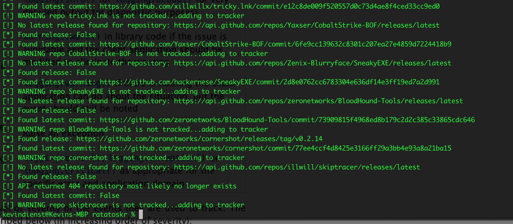

# Ratatoskr #


[What is a ratatoskr?](https://en.wikipedia.org/wiki/Ratatoskr)

> This tool is designed to interact with GitHub and GitLab APIs and send webhooks to Rocket.Chat in the event that new releases or commits are made to selected repositories of interest.
> Python script with sqlite3 `tracker.db` file that maintains persistent data.

## Features ##

1. Integration with GitHub API.
2. Integration with Rocket.Chat via webhooks.
3. Integration with GitLab API.
4. Supports HTTP Sessions.
5. Automatic commit, rollback and DB connection closure and error handling.
6. Supports tracking latest releases and latest commits in case repository doesn't use releases.
7. Basic Create, Read, and Update support for sqlite3.
8. Per GitHub API - Uses user-agent header specific to tool.
9. Reproducible builds via `Pipfile.lock` file.

## Install ##

### Clone repository ###

```shell
git clone https://github.com/axi0m/ratatoskr
cd ratatoskr/
```

### Using pipenv ###

```shell
pipenv install
```

### Using requirements.txt ###

```shell
pip install --user requirements.txt
```

## Usage ##

### Environment ###

Assumes you have pipenv installed, in your path and you've got a GitHub Personal Access Token exported to environmental variable `GITHUB_TOKEN`. Python 3.6+

You must create a reference file called `GitHub_Tools_List.csv` in the current working directory with the URLs of the repositories you want to monitor.

### Example GitHub_Tools_List.csv ###

```csv
Repo,Category,Currently Used with Approved Aggressor Collection,Added Date
https://github.com/0x09AL/RsaTokenExtractor,.NET Assembly C# Tools,,
https://github.com/0xhexmex/Aggressor-Scripts,aggscripts,,
https://github.com/0xthirteen/CleanRunMRU,.NET Assembly C# Tools,,
https://github.com/0xthirteen/MoveKit,.NET Assembly C# Tools,,
```

### Help ###

```shell
pipenv run python3 ratatoskr.py --help
```


### Load your repositores to monitor ###

```shell
pipenv run python3 ratatoskr.py --load
```



### First Run ###

You will want to have a Personal Access Token for GitHub and GitLab, and the Rocket.Chat webhook exported to environment variables before attempting to load or run the script.

```shell
export GITHUB_TOKEN='REDACTED'
export GITLAB_TOKEN='REDACTED'
export ROCKETCHAT_WEBHOOK='REDACTED'
pipenv run python3 ratatoskr.py --check
```


## References ##

- [Python Requests - Sessions](https://docs.python-requests.org/en/master/user/advanced/#session-objects)
- [Python Standard Library - sqlite3](https://docs.python.org/3/library/sqlite3.html)
- [Using Context Managers with sqlite3](https://docs.python.org/2/library/sqlite3.html#using-the-connection-as-a-context-manager)
- [StackOverflow - Commit and Rollback and With statement](https://stackoverflow.com/questions/19522505/using-sqlite3-in-python-with-with-keyword)
- [StackOverflow - Cursor vs Connection object](https://stackoverflow.com/questions/6318126/why-do-you-need-to-create-a-cursor-when-querying-a-sqlite-database)
- [PyNative - CRUD Operations from Python](https://pynative.com/python-sqlite/#h-perform-sqlite-crud-operations-from-python)
- [GitLab API Docs](https://docs.gitlab.com/ee/api/api_resources.html)
- [Python Requests-HTML - Simple Webscraping](https://docs.python-requests.org/projects/requests-html/en/latest/)
- [Python Pipenv](https://pipenv.pypa.io/en/latest/)
- [Reproducible Builds](https://reproducible-builds.org/)
- [Python Rich - Beautiful CLI](https://github.com/willmcgugan/rich)
